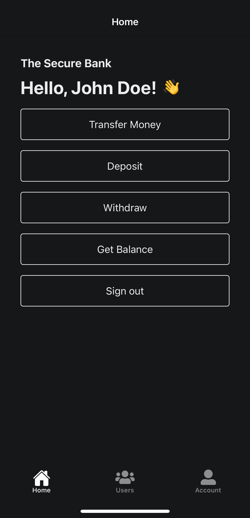
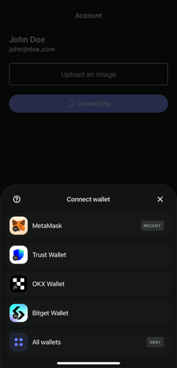
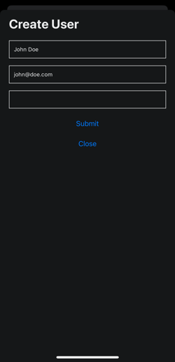
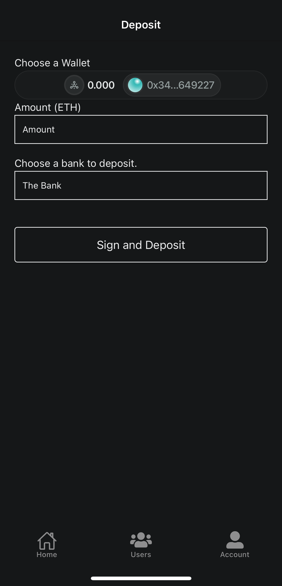
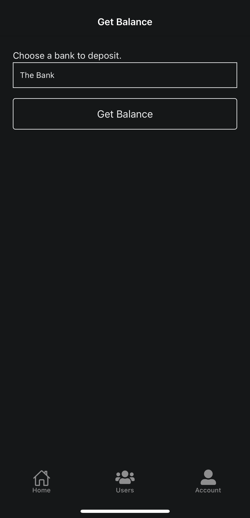
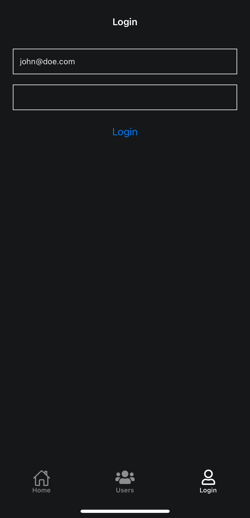
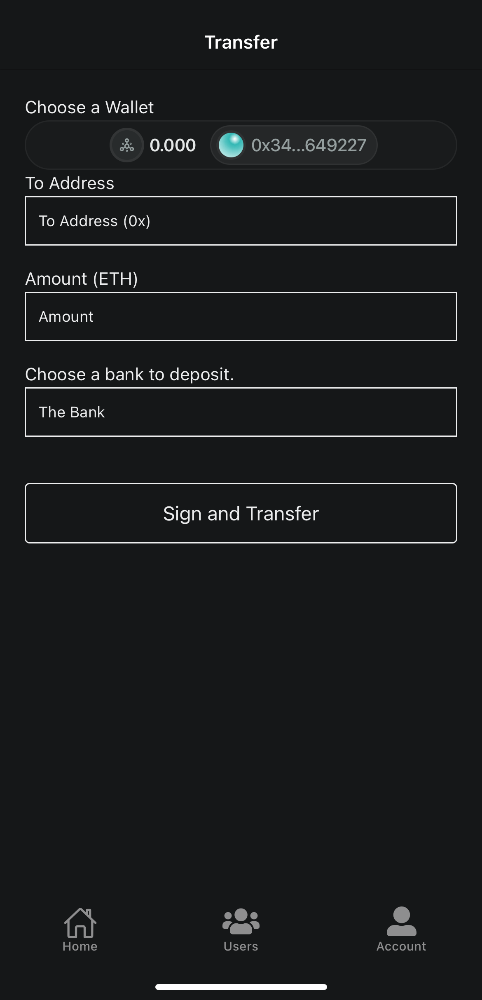
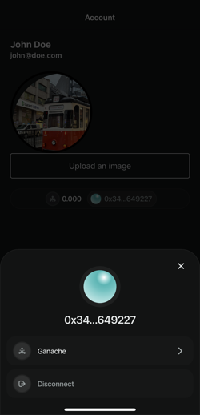

# Welcome to SmartBanking 👋

This is a **SmartBanking** project created with [Expo](https://expo.dev), designed to interact with a digital banking system using Ethereum smart contracts.

## Screenshots

Here are some screenshots of the application:

1. 
2. 
3. 
4. 
5. 
6. 
7. 
8. 

## Get started

1. 

# Contact Information

Feel free to reach out to me through the following channels:

- **LinkedIn**: [My LinkedIn Profile](https://www.linkedin.com/in/ofcskn)
- **Email**: [info@ofcskn.com](mailto:info@ofcskn.com)
